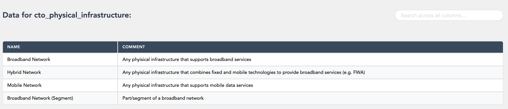
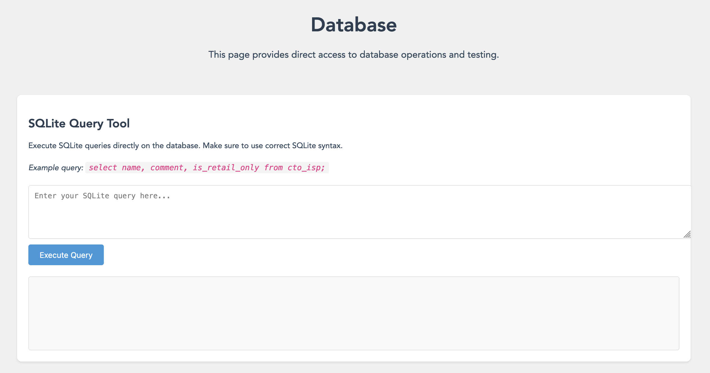
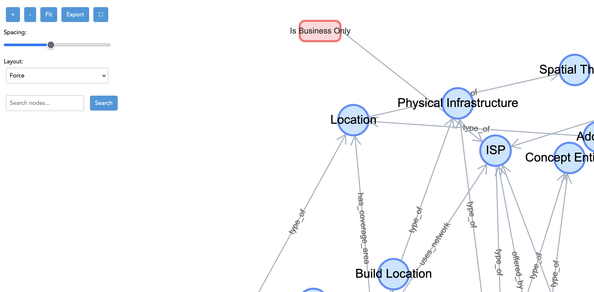

# Ontology Management System - PUBLIC

> This is a public version of a private repository with sensitive information and certain files removed.

## Overview

The Ontology Management System is designed to manage data related to telecommunications companies and their networks. It utilizes the Common Telecoms Ontology (CTO) developed by Point Topic to structure the real world of telecoms into categories and relationships. This system provides a framework for organizing and understanding complex relationships within the telecommunications industry.

## Technical Stack

- **Frontend**: Built with Express.js and EJS for server-side rendering.
- **Backend**: Developed using FastAPI, a modern web framework for building APIs with Python.
- **Database**: SQLite3 is used for data storage, with data populated via seed tables and queries to the Point Topic external database.

## Deployment

The deployment process is automated using a shell script (`deploy.sh`). Here are the steps it performs:

1. **AWS ECR Login**: Logs into the AWS Elastic Container Registry (ECR).
2. **Docker Image Build and Push**: Builds Docker images for both the backend and frontend, and pushes them to ECR.
3. **Docker Compose Configuration**: Updates the `docker-compose.yml` file with the latest image tags.
4. **Elastic Beanstalk Environment Setup**: Checks if the Elastic Beanstalk environment exists, creates it if not, and waits for it to be ready.
5. **Source Bundle Creation**: Creates a source bundle and uploads it to an S3 bucket.
6. **Application Version Management**: Creates a new application version in Elastic Beanstalk and updates the environment to use this version.
7. **Security Group Configuration**: Configures security group rules to allow HTTP and HTTPS traffic.
8. **Deployment Completion**: Outputs the public URL of the deployed application.

## Features

### Multi-Containered Elastic Beanstalk Setup

Frontend and backend individually containerized and deployed on AWS Elastic Beanstalk.

### One-Script Deploy

Deploy app using `deploy.sh`.

### Visualisations using G6.

G6 used for visualisations of underlying data from Sqlite3 database.

### LLM + Query Functionality

Uses nested prompts logic with functionality for LLM to form and execute queries, as well as retrieve and interpret output, if required.

### Log retrieval

Script to retrieve AWS EB logs (`get_logs.sh`)

## Screenshots

Nav bar:

Table rendering:

Query tool:

Visualisations:

